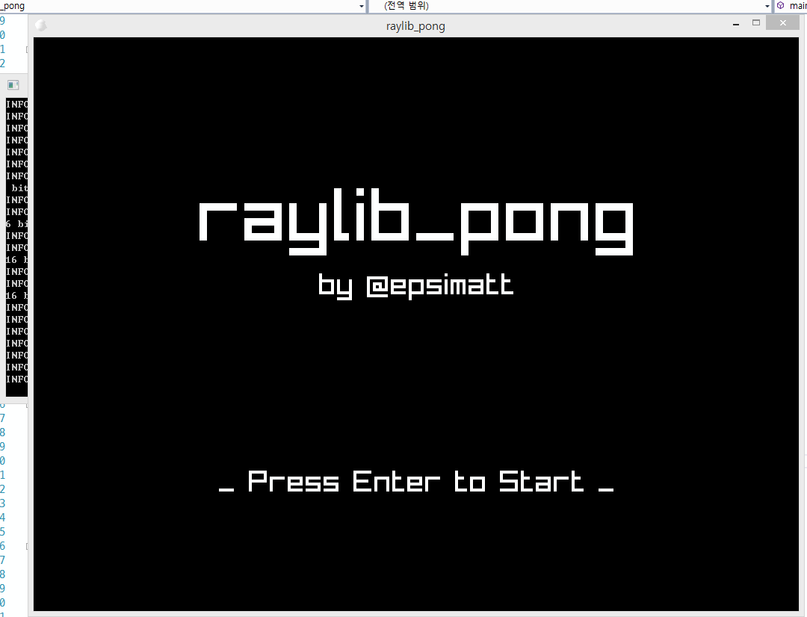

# raylib_pong

A classic pong remake written in C, made with [raylib](https://github.com/raysan5/raylib).

## Rules
- Two players control each paddle with `w` and `s` or `left arrow key` and `right arrow key` to hit the ball.
- Points are earned if one is unable to return the ball to the other player's side, and whoever gets to 11 points first wins the game.
- The speed of the ball is increased every time the ball hits a paddle, until either player earns a point.

## Screenshots

